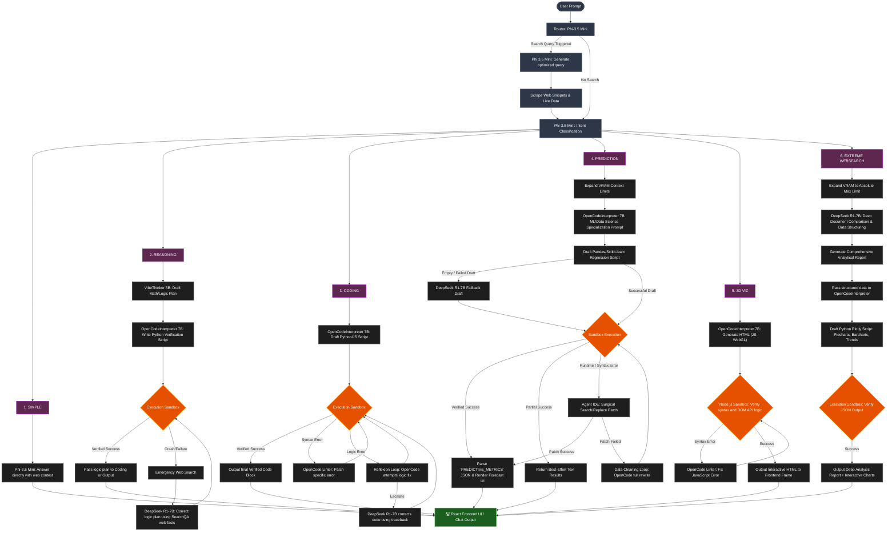

<div align="center">
  
# 🧠 DeepThink AIOS (Artificial Intelligence Operating System)

### A Fully Local Multi-Agent AIOS with Dual Sandbox Verification & Dynamic Hardware Scaling

*Running an orchestrated fleet of specialized LLMs on local hardware — from Intel iGPUs to NVIDIA H100s*


</div>

---

DeepThink AIOS is a **production-grade, fully local multi-agent Artificial Intelligence Operating System (AIOS)** designed to run multiple specialized LLMs locally on consumer and enterprise hardware. By leveraging a high-performance **6-Way Routing Pipeline**, DeepThink AIOS analyzes user intent to route queries through optimal reasoning, coding, math, predictive, and visual paths—**all executing 100% offline with zero cloud API dependencies.**

At startup, the system auto-calibrates to the available compute environment (CUDA, Intel XPU/SYCL, or CPU), scaling context windows, batch sizes, scraping depth, memory thresholds, and execution configurations dynamically.

> [!CAUTION]
> ### ⚠️ Experimental Status
> This project was developed as a submission for the **India Agentic AI Open Hackathon 2026**. The dual-sandbox architecture, Reflexion loops, and Dynamic Memory Allocator (DMA) push consumer hardware to its absolute limits.

---

## 🚀 Key Highlights & Achievements

* **India Agentic AI Open Hackathon 2026 Submission** (Shortlisting Round: July 9, 2026)
* **6-Way Intelligent Orchestration:** Transitions away from simple chat/search toggles to an intent-aware routing network.
* **Dual-Sandbox Code & Logic Verification:** Built-in isolated polyglot runtime environment verifying code outputs across 9 languages.
* **Dynamic Memory Allocator (DMA):** Out-of-memory (OOM) protection allowing large models (up to 7B parameters) to run seamlessly on consumer hardware (e.g. 16GB RAM / Intel Iris Xe iGPUs) using LRU-based swapping.
* **Claude-Style Interactive Visual Sandbox:** Generates live, glassmorphic Three.js 3D physics engines and Plotly.js charts rendered in secure iframe sandboxes.

---

## 🛠️ Complete Technology Stack

The system is constructed with a highly decoupled client-server architecture utilizing the following tools:

### Frontend (User Interface)
* **Framework:** React 19 (Functional components, hooks) with Vite (Ultra-fast build/dev tooling)
* **Styling & Layout:** Vanilla CSS (Glassmorphism, custom dark theme, premium transitions, responsive flexbox/grid)
* **Icons:** Lucide React
* **Markdown & Parsing:** `react-markdown` (supports live rendering of LaTeX blocks, code tables, and syntax highlighting)
* **Interactive Visualization:** Dynamic loading inside an isolated iframe sandbox utilizing `Plotly.js` and `Three.js` (WebGL)

### Backend (Model Orchestrator & API Gateway)
* **Framework:** FastAPI (Asynchronous, type-safe REST API endpoint validation)
* **ASGI Server:** Uvicorn (Asynchronous web runner)
* **Model Inference Engine:** Local `llama.cpp` server & HuggingFace integration (`transformers`, `accelerate`)
* **Vector Database (RAG):** ChromaDB (Local SQLite-backed semantic vector storage for indexing past verified solutions)
* **Real-time Web Access:** DuckDuckGo Search API (`ddgs`)
* **System Metrics Monitoring:** `psutil` (Tracks active processes, CPU cores, and RAM utilization for EVM hot-swapping)

### Verification Sandbox (Pre-Whitelisted Scientific & Cryptographic Libraries)
* **Scientific Computing & Math:** `numpy`, `scipy` (Numerical solvers & ODE integrations), `sympy` (Symbolic algebraic solver), `pint` (Physical units validation)
* **Theorem Proving & Constraints:** `z3-solver` (Z3 SMT Solver for math/logic boundaries)
* **Biological & Molecular Physics:** `biopython`, `rdkit` (Molecular structures and sequence parsing)
* **Data Science & ML:** `scikit-learn` (Regression, regression trees, forecasting), `statsmodels` (Time series models)
* **Space Dynamics & Astrodynamics:** `astropy`, `rocketpy`
* **Quantum Computing Simulations:** `qiskit`, `qutip`
* **Cybersecurity & Cryptography:** `cryptography` (Fernet, AES, RSA), `scapy` (Interactive packet crafting/sniffing), `pyjwt`, `pycryptodome`

---

## 🤖 6-Way Agentic Pipeline Architecture

```
                       User Prompt + Uploaded Image
                                    │
                                    ▼
                      ┌───────────────────────────┐
                      │ Qwen-2.5-VL Vision Parser │ (Extract text/diagrams)
                      └─────────────┬─────────────┘
                                    │
                                    ▼
                      ┌───────────────────────────┐
                      │    Phi-3.5-Mini Router    │ (Intent & Mode Classifier)
                      └─────────────┬─────────────┘
                                    │
    ┌───────────────┬───────────────┼───────────────┬────────────────┬──────────────┐
    ▼               ▼               ▼               ▼                ▼              ▼
  [PATH A]       [PATH B]        [PATH C]        [PATH D]         [PATH E]       [PATH F]
   SIMPLE         CODING        REASONING       PREDICTION      EXTREME SEARCH    3D VIZ
    │               │               │               │                │              │
    ▼               ▼               ▼               ▼                ▼              ▼
Phi-3.5-Mini   OpenCodeDS      VibeThinker 3B  OpenCodeDS       DeepSeek R1    OpenCodeDS
 Direct Ans    Actor-Critic     Reasoning Plan  ML Regression   Deep Analysis   WebGL & JS
    │               │               │               │                │              │
    ▼               ▼               ▼               ▼                ▼              ▼
Web Search    Execution       Sandbox         Data Cleaning    OpenCodeDS     Reflexion
 (Simple)     Sandbox         Verification     Loop (SciPy)    Plotly Charts  Sandbox Loop
    │               │               │               │                │              │
    └───────────────┴───────────────┴───────────────┴────────────────┴──────────────┘
                                    │
                                    ▼
                             Streamed Response
                         (Answer + Code + 3D Visual)
```



### Routing Pathways

1. **SIMPLE:** Fast, direct answers utilizing Phi-3.5-Mini. Best for general conversations and basic tasks.
2. **CODING:** OpenCodeInterpreter 6.7B acts as the generator, with an execution-driven feedback loop verifying code correctness.
3. **REASONING:** Powered by VibeThinker 3B, providing chain-of-thought mathematical and logic verification.
4. **PREDICTION:** A specialized ML pipeline that scrapes target web sources, cleans data frames, performs model fitting (Scikit-Learn/SciPy), and outputs regression/forecast statistics.
5. **EXTREME WEBSEARCH:** Employs DeepSeek R1-7B to perform deep thematic synthesis over scraped pages, feeding key data arrays into OpenCodeInterpreter to produce Plotly visualizations.
6. **3D VISUALIZATION:** Generates interactive Three.js physics scenes or Plotly.js canvases rendered directly in the web frontend.

---

## 🧩 The Fleet of Local Models

| Model Key | Base Model | Parameter Size | Quantization | Primary Role |
|---|---|---|---|---|
| **router** | Phi-3.5-Mini-Instruct | 3.8B | Q6_K | Intent classification, routing decision, search query generation |
| **vibethinker** | WeiboAI VibeThinker 3B | 3.0B | Q6_K | Mathematical reasoning, logic puzzles, step-by-step verification |
| **deepseek_r1** | DeepSeek-R1-Distill-Qwen-7B | 7.0B | Q6_K | Complex multi-turn logic, chain-of-thought analysis, data synthesis |
| **opencode** | OpenCodeInterpreter-DS-6.7B | 6.7B | Q6_K | High-quality code generation, ML scripting, 3D HTML artifact creation |
| **qwen_vl** | Qwen-2.5-VL-7B-Instruct | 7.0B | Q6_K_XL + mmproj | Vision parsing, text/code transcription from screenshots and charts |

---

## 🛡️ Key System Components

### 1 — Dynamic Memory Allocator (DMA)
Designed to make local multi-model pipelines possible on resource-constrained systems:
* **LRU Model Eviction:** Hot-swaps models dynamically from System RAM to GPU VRAM to ensure only one active model consumes GPU memory.
* **Unified Memory Guard:** Protects Intel Iris Xe iGPUs (running via Level Zero APIs) from memory allocation failures and host crash issues.
* **Automatic CPU Fallback:** Gracefully redirects model execution to CPU threads if VRAM allocations fail.

### 2 — Dynamic Scaling
Automatically scales execution parameters based on detected GPU compute capability:
* **H100 / B200:** Context ceiling up to 64K tokens, maximum search query depth.
* **RTX 3090 / 4090 / Intel Arc:** Context ceiling up to 32K tokens.
* **T4 / Intel Iris Xe:** Caps context ceiling to 8K-16K tokens, restricts batch sizes (`n_batch=512`, `n_ubatch=256`), and disables flash attention to maintain system stability.

### 3 — Isolated Polyglot Sandbox
Executes generated code safely inside a 3-tier isolated environment:
* **Languages Supported:** Python, C, C++, Java, JavaScript, Go, Rust, Bash, TypeScript.
* **Libraries Pre-Whitelisted:** `numpy`, `scipy`, `pandas`, `sklearn`, `plotly`, `sympy`, `networkx`, `z3-solver`.
* **Reflexion Loop:** Code syntax or runtime errors automatically spawn self-correction loops to repair the code before outputting results.

---

## 📂 Directory Structure

Below is the layout of the project directories and the purpose of each primary code module:

```
Team_Trenches/
├── backend/
│   ├── app.py                # FastAPI main application server & endpoint handlers
│   ├── orchestrator.py       # Core Multi-Agent Orchestrator & Pipeline logic
│   ├── downloader.py         # Multi-threaded Hugging Face model downloader
│   ├── memory.py             # Memory controllers & RAG database manager
│   ├── sandbox.py            # Code execution environments & verification sandbox
│   ├── search.py             # Web search integrations (DuckDuckGo, etc.)
│   ├── repo_map.py           # Helper script for repository structures
│   └── benchmark_runner.py   # Benchmark execution and reporting engine
├── frontend/
│   ├── src/
│   │   ├── App.jsx           # Main React component (dynamic UI, glassmorphic layout, stream parsers)
│   │   └── main.jsx          # React initialization script
│   ├── package.json          # Node package dependencies & configurations
│   ├── index.html            # Main Single Page Application template
│   └── vite.config.js        # Vite compilation configuration
├── start.sh                  # One-click startup script (starts backend + frontend simultaneously)
├── requirements.txt          # Python backend package dependencies
└── README.md                 # Project main documentation
```

---

## 🖥️ System Requirements & Setup

| Resource | Minimum | Recommended |
|---|---|---|
| **RAM** | 16 GB | 32 GB |
| **Storage** | 25 GB free space | 45 GB free space |
| **OS** | Ubuntu 22.04+ / Windows 11 / macOS 14 | Ubuntu 24.04 / macOS 15 |
| **GPU** | NVIDIA/Intel/AMD (8GB VRAM) | NVIDIA RTX 3090/4090 or Apple Silicon |

### Quick Start (Linux/macOS)

1. **Clone the Repository:**
   ```bash
   git clone https://github.com/Bshdhorrhh/Team_Trenches.git
   cd Team_Trenches
   ```

2. **Setup Python Environment:**
   ```bash
   python -m venv venv
   source venv/bin/activate
   pip install -r requirements.txt
   ```

3. **Install Frontend Dependencies:**
   ```bash
   cd frontend && npm install && cd ..
   ```

4. **Launch Backend and Frontend:**
   ```bash
   chmod +x start.sh
   ./start.sh
   ```

Open `http://localhost:5173` in your web browser. Model weights will download automatically upon first request or can be pre-downloaded via settings.

---

## 📊 Project Statistics & Final Audit

DeepThink AIOS has undergone a comprehensive system audit to verify code quality, structure, and execution safety before submission.

### Core Architectural Features Audited & Verified
1. **📦 Automated Model Ingestion (`downloader.py`):**
   * Multi-threaded model downloader with automatic SHA-256 checksum verification.
   * Pulls directly from Hugging Face repositories with built-in CDN fallback links.
   * Instantly resolves model directories without manual file placements.

2. **🧠 ChromaDB Semantic RAG Memory (`orchestrator.py`):**
   * SQLite-backed local vector indexing of past successfully validated code blocks and scientific equations.
   * Auto-recalls proven calculations to bypass redundant processing and prevent repeat errors.

3. **🔁 Nuclear Reset Loop (`orchestrator.py`):**
   * Safeguard against infinite logic repair loops. If correction loops fail 3 times, a "Nuclear Reset" is triggered.
   * DeepSeek-R1-7B extracts concrete "lessons from failure", wipes the active model's memory state, and starts a fresh mathematical draft containing the failure lessons.

---

## 👥 Team
**Team Trenches** — Submission for the India Agentic AI Open Hackathon 2026.
